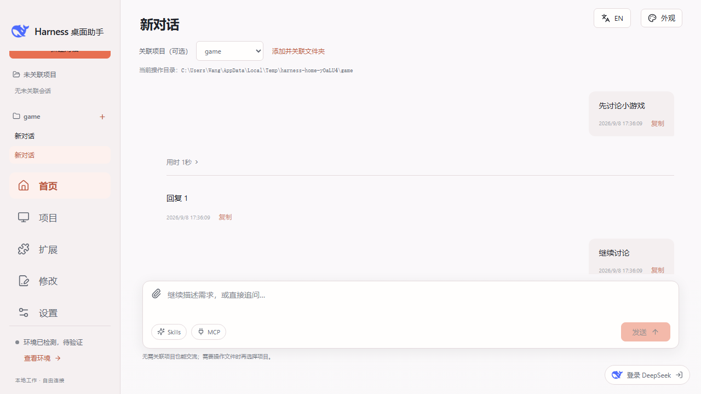
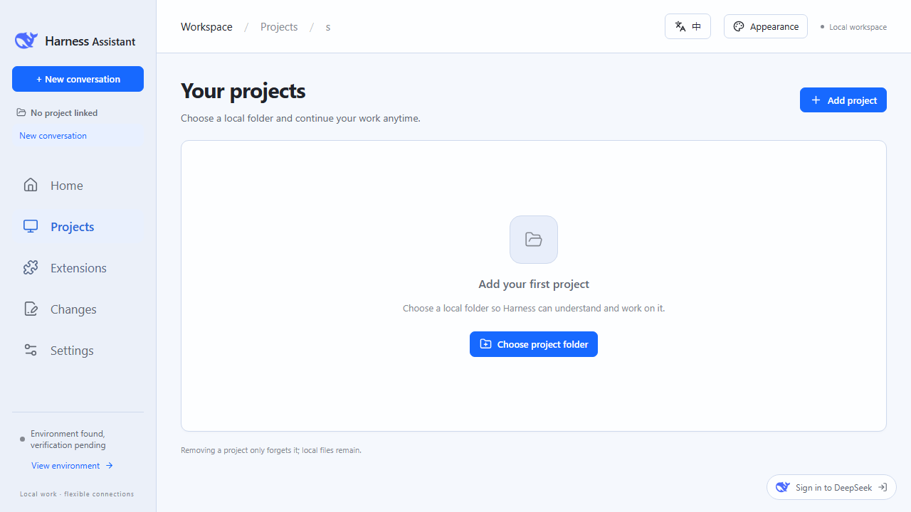
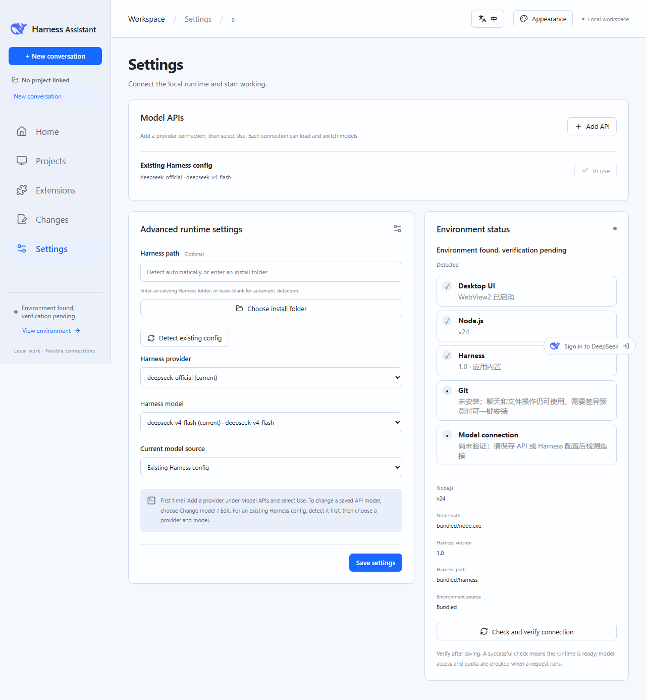
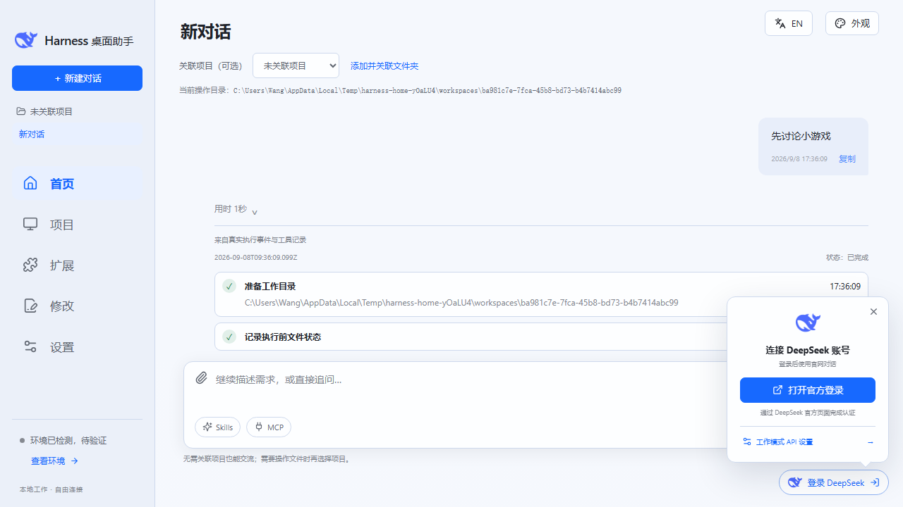
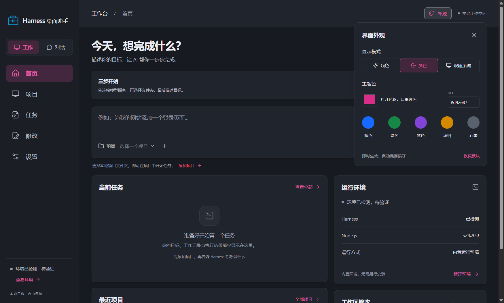

<p align="center"></p>

# Harness 桌面助手

**把 AI 工作与日常对话放进一个简单的桌面应用。** · [English](README.en.md)

不选项目也能连续交流，需要处理文件时再关联文件夹。每次工作都会显示真实操作步骤，出错时指出失败阶段并提供重试。界面支持中文与英文。

这是基于 DeepSeek Harness 的独立桌面项目，**不是 DeepSeek 官方产品**。当前版本为 **v0.4.0**，提供 Windows 10/11 x64 安装包。

**[下载安装包](https://github.com/anli1231381-del/DeepSeek-Harness-Desktop/releases/latest)** · [快速开始](#快速开始) · [常见问题](#常见问题) · [反馈问题](https://github.com/anli1231381-del/DeepSeek-Harness-Desktop/issues)



<details><summary>English interface</summary>





</details>

## 可以做什么

| 功能 | 使用方式 |
| --- | --- |
| 工作模式 | 首页直接连续对话；可不关联项目，也可随时关联或切换本地项目 |
| 对话模式 | 右下角登录入口打开 DeepSeek 官网，工作对话与官网账号互不覆盖 |
| 模式切换 | 保留工作草稿与网页会话，切换不会停止正在运行的工作任务 |
| 模型配置 | DeepSeek、OpenAI、OpenRouter、Anthropic 预设，自动填写地址与协议；也支持自定义兼容服务 |
| 模型选择 | 填写密钥后获取模型列表，支持更换模型与手动填写模型 ID |
| 文件成果 | 自动记录执行期间新增、修改、删除的文件，查看历史对比、打开文件或目录 |
| 会话与队列 | 保存多轮历史、实时刷新执行记录，支持停止执行和取消排队 |
| 扩展管理 | 导入本地或 GitHub Skill，管理 MCP 服务，选择全局或项目范围并检测加载状态 |
| Git 环境 | 检测本机 Git、显示版本并提供安装引导 |
| 运行环境 | 内置 Node.js 与 Harness，支持检测已有 Harness 配置 |
| 自动体检 | 启动后逐项检查桌面界面、Node.js、Harness、Git 和模型连接；失败时显示具体阶段与原因 |
| Git 补齐 | 未安装 Git 时可调用 Windows Winget 一键安装，并保留 Git 官方下载入口 |
| 工作过程 | 展示工作目录、Harness 启动、工具与目标、成果捕获；失败步骤可复制错误或再次执行 |
| 界面语言 | 中文、English 一键切换并自动保存选择 |
| 界面外观 | 浅色、深色、跟随系统，自由色盘与 HEX 主题色，偏好自动保存 |

## 下载安装

1. 打开 **[Releases 下载页面](https://github.com/anli1231381-del/DeepSeek-Harness-Desktop/releases/latest)**。
2. 在 **Assets** 中下载以 **`windows-x64-setup.exe`** 结尾的安装包。
3. 双击安装，从桌面或开始菜单打开 **Harness 桌面助手**。

普通用户只需要安装包。GitHub 的 **Code → Download ZIP** 和 Release 中的源码压缩包用于开发，不能直接当作软件运行。

安装包已包含 Node.js 和 DeepSeek Harness，无需预先安装 Node、npm、Rust 或 Harness。若电脑缺少 WebView2，安装器会联网补齐。软件启动后自动显示各组件状态；Git 缺失时可在“扩展”中一键安装。官网对话、远程模型服务和环境下载需要联网。

## 快速开始

### 我只想聊天

点击右下角 **登录 DeepSeek**，再选择 **打开官方登录**。官网登录与首页工作对话分开保存，不会清除当前会话。无需配置 API，也无需添加项目。

网页加载有问题时，可点击 **刷新网页** 或 **在浏览器打开**。默认浏览器与应用内网页分别管理登录状态；官网的功能、登录方式和界面由 DeepSeek 提供。



### 我想让 AI 帮我完成工作

1. 进入 **设置 → 模型 API → 添加 API**。
2. 选择服务商，填写自己的 **API 密钥**。预设会填入地址与协议，模型列表随后自动加载。
3. 选择模型，点击 **保存 API**，再点击配置旁的 **使用**。
4. 点击 **检测并验证连接**，确认运行环境就绪。
5. 回到首页直接发送消息；需要处理文件时，再通过 **关联项目（可选）** 选择项目。
6. 回复和执行过程直接显示在同一段连续对话中；在 **修改** 查看文件差异。

例如：`先阅读这个项目，解释主要目录的作用，并列出可以改进的地方。`

API 的权限和额度在实际请求时由服务商检查。软件不附带模型额度，DeepSeek 网页登录也不会自动变成工作模式的 API 授权。

### 使用 OpenRouter

在 **设置 → 模型 API → 添加 API** 中选择 **OpenRouter**，默认使用 `https://openrouter.ai/api/v1` 和 OpenAI 兼容 Chat Completions 协议。填写 OpenRouter 密钥后获取模型，选择模型并保存，再点击“使用”。也可以手动填写 OpenRouter 提供的完整模型 ID（通常为 `服务商/模型名`）。密钥继续由 Windows 加密保存。

### 会话执行

点击侧栏“新建会话”即可开始，无项目会话会在应用数据目录下分配独立工作目录。每个项目可新建多段独立对话，关联或切换项目时保留当前历史并显示真实操作目录。发送会立即保存并加入全局队列；同一时间只运行一个执行。可停止当前执行或取消等待项；停止不会回滚已修改的文件。重启后恢复会话历史与上下文，但不会自动重跑未完成的执行。

### Skills、MCP 与 GitHub 扩展

进入 **扩展** 可导入包含 `SKILL.md` 的本地技能文件夹，或粘贴公开 GitHub 仓库及其 `tree` 目录链接。Skill 支持全局和当前项目范围、启用、停用、更新与删除，并区分“已发现”和真实执行后的“已加载”。MCP 支持远程 HTTPS、本地启动程序及 JSON 配置导入，可执行真实连接测试并查看工具列表。密钥由 Windows 当前用户加密保存，不会显示明文。

### 我已经安装过 Harness

在设置中选择 **已有 Harness 配置**，点击 **检测已有配置**，选择服务商与模型并保存。检测列出本机配置，不代表密钥已经获得模型访问权限。高级设置中也可以指定 Harness 安装目录。

## 自定义外观

点击右上角 **外观**，选择浅色、深色或跟随系统；通过色盘或 HEX 值设置喜欢的主题色。偏好自动保存，外观设置作用于桌面界面，DeepSeek 官网保留自身的外观。



## 常见问题

**没有安装开发环境，也没有 Harness，可以用吗？**

可以。Windows 安装包包含应用自身所需的 Node.js 和 Harness，WebView2 由安装程序补齐，Git 可在软件内检测并一键安装。Python、Java 或编译器属于具体项目的可选依赖，软件会显示相关执行错误，但不会在没有项目需求时擅自安装。

**为什么获取不到模型？**

检查 API 地址、协议、密钥和服务商权限。部分接口不提供模型列表，可以选择 **手动填写模型 ID**。列表中的模型是否支持当前协议、工具调用和任务，由服务商决定。

**在哪里更换模型？**

进入 **设置**，在对应 API 配置旁点击 **更换模型 / 编辑**。可重新获取列表，选择模型后保存。

**能添加多个 API 吗？**

可以添加、编辑、切换和删除多组配置。API 密钥由 Windows 当前用户加密保存在本机，列表中不显示明文；更换接口地址或协议后需要重新填写密钥。

**切到对话模式，工作任务会停止吗？**

不会。网页会话和工作任务分别保留，工作任务可以在对话模式下继续完成。

**没有安装 Git，为什么看不到修改对比？**

Git 差异预览需要 Git；其他任务功能仍可使用。进入“扩展 → Git 环境”可检测并一键安装，失败时会显示安装阶段和官方备用入口。

## 当前版本范围

- 提供 Windows 10/11 x64 安装包，暂未提供 macOS、Linux 或 Windows ARM 原生包。
- 一次运行一个工作任务；停止后保留记录，暂不支持从停止位置续跑。
- 当前 Harness SDK 无交互审批回复接口，权限受限的操作可能需要在 Harness 中处理。
- 自定义模型采用保守的 32K 上下文描述和单次 4K 输出上限，服务商实际限制仍优先。
- 界面展示最近 500 条工作事件和最多 200,000 字符回复，完整会话日志由 Harness 管理。
- 安装包目前未配置代码签名。已验证本地安装和独立运行环境；全新 Windows 虚拟机上的首次安装仍待验证。

应用不会把你的 API 密钥、项目或网页登录状态打进安装包。工作模式会按任务需要将项目内容发送给你选择的模型服务。详细验证范围见 [验证记录](docs/verification.md)。

<details>
<summary>API 地址与高级配置</summary>

| 协议 | 基础地址示例 | 填写说明 |
| --- | --- | --- |
| OpenAI 兼容 · Chat Completions | `https://服务商地址/v1` | 不要附加 `/chat/completions` |
| OpenAI · Responses | `https://服务商地址/v1` | 不要附加 `/responses` |
| Anthropic · Messages | `https://api.anthropic.com` | 程序添加 `/v1/messages`，无需重复填写 `/v1` |

远程接口使用 HTTPS；HTTP 仅用于 localhost、127.0.0.1、::1 的本机服务。请使用服务商提供的精确模型 ID。编辑已有配置时密钥留空可保留旧密钥；更换地址或协议后需重新填写。

模型发现仅请求模型列表，不发起生成任务；兼容接口和额度以各服务商提供的服务为准。

</details>

## 开发与构建

使用 **Tauri 2 + React + TypeScript** 构建独立界面，通过本地桥接调用 DeepSeek Harness。

准备 Node.js 24、Rust、Windows C++ 构建工具及 Windows SDK，然后运行：

```powershell
npm ci
npm run tauri -- dev
```

```powershell
npm test                     # 运行时与配置测试
npm run build                # TypeScript 检查和前端构建
./scripts/desktop.ps1 check   # Rust 编译检查
./scripts/desktop.ps1 bundle  # 准备内置环境并生成 Windows 安装包
```

浏览器预览使用 `npm run dev`；本地项目和内嵌官网需要完整桌面程序。原生 UI 测试需要 PowerShell 7，通过环境变量指定 Playwright 和构建后的 EXE；设置 `HARNESS_SMOKE_CHAT=1` 可同时验证对话模式。

构建、GitHub Actions 和第三方依赖分发详见 [分发指南](docs/DISTRIBUTION.md) 与 [第三方声明](THIRD_PARTY_NOTICES.md)。第三方组件分别遵循其自身许可证。

## 反馈与交流

欢迎通过 **[Issues](https://github.com/anli1231381-del/DeepSeek-Harness-Desktop/issues)** 反馈问题或提出建议。请说明软件版本、Windows 版本、复现步骤，以及去除密钥和个人信息后的截图。
